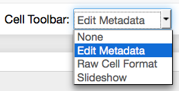

The notebook functionality of Python provides a really amazing way of analyzing data and writing reports in one place. However in the standard configuration, the pdf export of the Python notebook is somewhat ugly and unpractical. In the following I will present my choices to create almost publication ready reports from within IPython/Jupyter notebook.

# Plugins

Although the IPython/Jupyter notebook is pretty nice, it supports plugins to add some nice features that are useful when writing a scientific article within the notebook.  In the following I will present the plugins I find useful when I write my notebooks.

### Installation
Most of the plugins are available from a [central repository](https://github.com/ipython-contrib/IPython-notebook-extensions). For installation simply clone the repository and run `python setup.py install`. After that you can simply add `/nbextensions/` to the url of your IPython/Jupyter notebook server (instead of `/tree/`) and simply activate the plugins that suit you.

### codefolding
This small plugin allows code to be folded away at function definitions etc. However I mostly use it to give each cell a comment at the beginning to describe its content and fold away on that first line, so that I can quickly scroll through the notebook.

### python-markdown
This one is a very handy plugin. Out of the box, the notebook unfortunately can't display the content of python variables. This plugin adds this functionality. Any python code that is within double curly brackets `{{ ... }}` in a Markdown cell get's evaluated. It has some caveats though. First the notebook has to be trusted (`File->Trust Notebook`), otherwise the JavaScript magic does not work. Second, make absolutely sure that you write correct Python inside, since if the Python evaluation fails, you will get no feedback, just an empty string there. Writing bad code can also screw up the whole Python kernel, forcing you to restart the kernel. This can also happen randomly, the plugin seems to not be the most stable one.

If you want to convert your notebooks using `nbconvert`, you will need a preprocessor, something which I will describe further below.

### cite2c
This is a very useful plugin, that easily manages citations in the notebook. Clone the [git repository](https://github.com/takluyver/cite2c) and run `python install.py`.

It connects to the Zotero (www.zotero.org) citation management system, that works from within the browser. It's free and I can truly recommend it. You will need a Zotero ID to use this plugin. If you first click on one of the buttons in button bar of the notebook it will ask for your Zotero ID, which is **not** your username. To get it, log into Zotero and go to `Settings->Feeds/Api`. Note that you also have to make your article library publically available (`Settings->Privacy->Publish entire library`), since unfortunately the plugin does not make use of the auth mechanism. Keep also in mind that the choice of the userid for the plugin is a global one and is not stored on a per-notebook basis.

For conversion you will also need the preprocessor I provide below.

# Snippets
### Useful packages and matplotlib preamble
If you do scientific analysis you will almost certainly want the `numpy` package, as it provides all the basic numerics functionality. One might also need certain parts of the `scipy` package. I strongly recommend against importing using the `from` statement, since you might accidentally overwrite function names. As you certainly want graphical output you also need the `matplotlib` package together with the `inline` magic command. If you want to convert later to pdf format, raster graphics such as png are not well suited, because they are either larger (at high) resolution or do not render nicely (low resolution). The trick is to render `png` and `pdf` formats and save them within the notebook. Another option would be `svg`, but if you plot complex graphs (such as data with many data points) this slows down the browser significantly up to the point of failure. I also like to use the `usetex` rendering option of matplotlib since it produces nicer labels, especially together with the serif font. The PrettyTable is a class I describe next.

Here is my full notebook preamble with some options to make the plots more publication ready:
```python
# load libraries and set plot parameters
import numpy as np
import PrettyTable as pt

import matplotlib.pyplot as plt
%matplotlib inline

from IPython.display import set_matplotlib_formats
set_matplotlib_formats('pdf', 'png')
plt.rcParams['savefig.dpi'] = 75

plt.rcParams['figure.autolayout'] = False
plt.rcParams['figure.figsize'] = 10, 6
plt.rcParams['axes.labelsize'] = 18
plt.rcParams['axes.titlesize'] = 20
plt.rcParams['font.size'] = 16
plt.rcParams['lines.linewidth'] = 2.0
plt.rcParams['lines.markersize'] = 8
plt.rcParams['legend.fontsize'] = 14

plt.rcParams['text.usetex'] = True
plt.rcParams['font.family'] = "serif"
plt.rcParams['font.serif'] = "cm"
plt.rcParams['text.latex.preamble'] = "\usepackage{subdepth}, \usepackage{type1cm}"
```

### Create tables with python code
While you can write nice tables in the markdown cells and using the `python-markdown` plugin even have dynamic content, there is no builtin way to convert arrays directly to a nice table. This is where i wrote the [PrettyTable.py](PrettyTable.py) class for. You can than write something like this:
```python
data = np.array([[1,2,3],[2,3,4]])
pt.PrettyTable(data, [r"$\frac{a}{b}$", r"$b$", r"$c$"])
```
Make sure that the `pt.PrettyTable` command is always in the last line of the input cell and has no trailing semicolon, otherwise the notebook does not convert the output properly. It takes a two-dimensional (!) numpy array and converts it to a table. The second parameters with the captions is optional and as you can see from the code you can also use LaTeX commands in there.

Although i didn't thoroughly tested it, it should give nice output for both HTML and LaTeX/pdf.

### Reading large text files
Reading text files using `numpy` is unfortunately not the fastest thing. The `numpy.loadtxt()` function loads the full file into the memory first, which makes it memory consuming and slow for large files. It also supports only one comment character, but the `.xvg` files I frequently use have to different beginning characters for non-data lines. I was also not satisfied by the other options provided by `numpy`, so here is what I came up with, to have a relatively convenient function for loading twodimensional large text files with numerical data:
```python
def loadtxt(filename, ncols=None, dtyp=None, commentchars=["#","@"]):
    global data
    if ncols==None:
        with open(filename) as f:
            l = f.readline()
            while l[0] in commentchars:
                print l
                l = f.readline()
            ncols = len(l.split())
            data = np.fromfile(filename, sep=" ", dtype=dtyp)
    return data.reshape((len(data)/ncols, ncols))
```

### Saving data using numpy.savez
I often include computationally expensive data analysis in my notebook instead of implementing them as external tools. Since I would have to recalculate these if I restart the kernel for some reason, it is reasonable to save them using the `numpy.savez()` routine. I usually define a `data_dir` variable in the beginning of the notebook, where the datafiles are to be stored. I then use the following code template in each cell where I do expensive things and change the `recalc` variable if I need to recompute this cell:
```python
recalc = False

if recalc==True:
    ### create data1, data2, ... arrays

    outfile = open(data_dir+"data1_data2.npz","w")
    np.savez(outfile, data1=data1, data2=data2)
    outfile.close()
else:
    infile = open(data_dir+"data1_data2.npz")
    npzfile = np.load(infile)
    data1 = npzfile["data1"]
    data2 = npzfile["data2"]
    infile.close()
```

# Writing notebooks
A lot has been written by other people already on how to use the IPython/Jupyter notebook, so I will concentrate on some small things I found out and changed myself. Some nice examples are give on the [IPython notebook website](http://nbviewer.ipython.org/github/ipython/ipython/blob/2.x/examples/Notebook/Index.ipynb) and a nice interactive demo is available from the [Nature magazine](http://www.nature.com/news/ipython-interactive-demo-7.21492).

### Document Metadata
The exporter template I provide below supports author, title and affiliation to be stored in the notebook's metadata. For that go to `Edit->Edit Notebook Metadata` and add:
```
"latex_metadata": {
  "title": "Amazing Article",
  "author": "Julius C. F. Schulz",
  "affiliation": "Freie Universit\\\"at Berlin, Fachbereich Physik, 14195 Berlin, Germany"
},
```
Note that you might or might not put the trailing comma in there depending on whether this section is last. Due to the cite2c plugin the metadata can also get quite lenghty, so you probably have to do a good amount of scrolling, if you don't do this right at the beginning of writing your notebook.

### Markdown and LaTeX
You can us LaTeX code in your markdown cells through `MathJax` and even the AMSMath environments like `equation`, `align`, etc. are available.

One issue however remains and this is equation numbering. I haven't yet found a way that makes me entirely happy. What works somewhat decent if you only intend to export pdf anyway is just use traditional latex commands `\label{eq:someeq}` in the formula and later on `\ref{eq:someeq}` when you cite your equation. The issue is that this way, in the notebook itself only `???` is displayed at the reference. To avoid this you can also write something like this:
```
\begin{equation}
\int f(x)\,\text{d}x = F(x)
\label{eq1}
\tag{eq1text}
\end{equation}

... \ref{eq1} ...

```
This way, the equation can be properly referenced in the ipython notebook using `eq1` as the reference handle and `eq1text` as the reference text. It does not provide automatic numbering however. It also required a browser refresh for me to work after executing the markdown cell.

So choose whichever way suits you. Note that sometimes the `\label{...}` command fucks up the markdown conversion and the raw LaTeX code is displayed. In this case just refresh the browser.

Note: I recently found this [plugin](https://github.com/ipython-contrib/IPython-notebook-extensions/tree/master/nbextensions/usability/equation-numbering). I have yet to try it, but it might resolve the issues.

### Figures
Figures are some particularly problematic subject, since there is no direct way to embed captions from matplotlib. The standard way of `nbconvert` also does not put them as floating figures in the LaTeX code but directly puts them at their point of occurence. Below I will discuss how to modify the `nbconvert` templates to put in figures as floats. Now I will discuss, how to use these extensions. The additional data is stored in the cell metadata of the plot creating input cells. To edit them, you will first need to activate the `Edit Metadata` button in the button bar of the ipython notebook:



Next click the `Edit Metadata` button of the respective input cell:


You should get a screen like this:


You should add the lines present in the screenshot:
```
"caption": "somecaption",
"label": "fig:somelabel",
"widefigure": true
```

The last line is optional and creates a double column picture if a two-column layout is used. Some caveats on editing JSON metadata: JSON does not know comments, so don't try to use some. The strings have to be in one line and JSON does not know multiline strings; this is quite annoying for long captions, as the metadata editor is not really suited for that. Escape characters like `\` etc. The last line must not have a trailing comma otherwise it will not work.

The label can be used together with `\ref{fig:somelabel}` in markdown cells, however since the notebook does not really know the label, it will only show `???` there. But the inside the LaTeX/pdf conversion things work beautifully.

I recommend to have the last command in the plottin input cell to have a trailing semicolon to avoid any annoying output cells.

### Citations
Citations are an important part of any scientific work. The cite2c plugin described above is very useful for embedding them into IPython/Jupyter notebooks. The plugin adds two buttons to the button bar.


With the first you can search your Zotero library and add a citation at the current cursor position in a Markdown cell. The bibliographic data is embedded into the notebook so if the notebook is shared with other people they do not need access to your Zotero account.

The second button adds the actual bibliography into the markdown cell. This should be placed at the bottom of the article. It is dynamically updated using JavaScript in the browsers.

Using the preprocessor described below, the bibliographic data can be converted to LaTeX citations and BibTex files to create proper citations in LaTeX.

# Converting notebook to LaTeX/PDF
With the `nbconvert` command IPython/Jupyter provide an amazing way of converting the notebook to a variety of formats, most notably HTML and LaTeX. For converting the notebook to LaTeX with all of the above features you will need four additional files: the `pymdpreprocessor.py` preprocessor, the `bibpreprocessor.py` preprocessor, a suitable template file (eg. the `revtex_nocode.tplx` file provided by me) and a config file.

The config file should be named `jupyter_nbconvert_config.py` or `ipython_nbconvert_config.py`, depending on whether you use IPython or Jupyter. Note that this is not determined if you use `ipython nbconvert` or `jupyter nbconvert` but by the installed backend, this would typically Jupyter if you have an up-to-date installation. The configuration file has to be placed in the same directory as the notebook and contain the followin content (you might have to change the name of the template file):
```python
c = get_config()
c.Exporter.preprocessors = [ 'bibpreprocessor.BibTexPreprocessor', 'pymdpreprocessor.PyMarkdownPreprocessor' ]
c.Exporter.template_file = 'revtex_nocode.tplx'
```

The `pymdpreprocessor.py` is provided in the `nbextensions` git repository and has to be in the `$PYTHONPATH` environment variable or also in the same directory as the notebook. The `bibprepreprocessor.py` file can be obtained [here](bibpreprocessor.py) and is described below if you are interested in the details.

The [`revtex_nocode.tplx` file](revtex_nocode.tplx) will create a LaTeX file for a double column article using the RevTex document class. The details are described further down. Note that this file has to be in the directory of the notebook, stating a different directory in the config file unfortunately does not work.

If all is layed out as above, the command to convert the notebook to a LaTeX file is `ipython nbconvert --to=latex SomeNotebook.ipynb` or `jupyter nbconvert --to=latex SomeNotebook.ipynb`. This creates a `SomeNotebook.tex` source file along with a `SomeNotebook_files` folder containing the images and the BibTex file. While `nbconvert` does have a `--to=pdf` option that automatically creates a LaTeX file and runs `pdflatex` to create the pdf file, at least on my machine it unfortunately does not call the `bibtex` command. So I suggest to write a little script like this to automate things:
```
#!/bin/bash

ipython nbconvert --to=latex --template=revtex_nocode.tplx SomeNotebook.ipynb
pdflatex SomeNotebook.tex
bibtex SomeNotebook.aux
pdflatex SomeNotebook.tex
pdflatex SomeNotebook.tex

rm *.bbl *.aux *.blg *.log *.out *Notes.bib #*.tex
```

The following sections describe the technical details and are only for the interested reader.

### BibTex-Preprocessors
The cite2c plugin stores its bibliographical information in the metadata of the notebook. The LaTeX typesetting needs a BibTex file however. Furthermore, the citations in the text are based on HTML and are not understood by TeX. We therefore need the preprocessing ability of `nbconvert`. This is done by the `BibTexPreprocessor` class in the [bibpreprocessor.py file](bibpreprocessor.py).

Any prepocessor class has to inherit from `IPython.nbconvert.preprocessors.Preprocessor`. Then the overloaded `preprocess()` function is called. In there we first call the `create_bibfile()` method, that creates a `.bib` file from the bibliographic entries in `nb["metadata"]["cite2c"]["citations"]`. So far only article-type references are implemented, however this can easily be extendend. Unfortunately, BibTex does not deal well with Unicode characters, even the error message is very cryptic. For the author name and the journal name I therefore use the funtion `replace_char()` to replace some common non-ASCII characters. This might also have to be extended further.

After creating the BibTex file we have to replace the bibliography part in the text. We therefore loop over all cells and look for `<div class="cite2c-biblio"></div>` and replace it with the `\bibliography` command for the TeX source code (in `preprocess_cell()` method). The individual citations are conveniently already converted by `nbconvert`.

### Templates
The `nbconvert` command utilises templates to convert the notebook into different formats. These are built in a modular way and can be easily extended. They usually come with the extension `.tplx`. [Here](revtex_nocode.tplx) I present a template for a double column article based on the RevTex LaTeX document class. Writing template files is blockbased. Further information can be found [here](http://nbviewer.ipython.org/github/jupyter/nbconvert/blob/master/docs/source/customizing.ipynb).

#### LaTeX documentclass and preamble
```
((*- extends 'article.tplx' -*))
```
This is the first line of the template file and tells to extend the already existing article template, which provides most functionality for LaTeX conversion already.

```
((* block docclass *))
\documentclass[reprint, floatfix, groupaddress, prb, longbibliography]{revtex4-1}

\usepackage{placeins}

\AtBeginDocument{
\heavyrulewidth=.08em
\lightrulewidth=.05em
\cmidrulewidth=.03em
\belowrulesep=.65ex
\belowbottomsep=0pt
\aboverulesep=.4ex
\abovetopsep=0pt
\cmidrulesep=\doublerulesep
\cmidrulekern=.5em
\defaultaddspace=.5em
}

((* endblock docclass *))
```
The first line sets the options for the chosen document class, i.e. RevTex. I also chose to use the `placeins` package, so that I can use `\FloatBarrier` to help with figure placement. The `\AtBeginDocument` section is necessary to use the nice table printing using the `longtable` and `booktabs` package that the `article.tplx` uses.

#### Metadata
The default behaviour of `nbconvert` is to use the notebook filename as the title, however this is not very convenient. Also the author name cannot be stored. I therefore use the notebook metadata for that.

```
% Author and Title from metadata
((* block maketitle *))

((*- if nb.metadata["latex_metadata"]: -*))
((*- if nb.metadata["latex_metadata"]["author"]: -*))
    \author{((( nb.metadata["latex_metadata"]["author"] )))}
((*- endif *))
((*- else -*))
    \author{Julius C. F. Schulz}
((*- endif *))

((*- if nb.metadata["latex_metadata"]: -*))
((*- if nb.metadata["latex_metadata"]["affiliation"]: -*))
    \affiliation{((( nb.metadata["latex_metadata"]["affiliation"] )))}
((*- endif *))
((*- endif *))

((*- if nb.metadata["latex_metadata"]: -*))
((*- if nb.metadata["latex_metadata"]["title"]: -*))
    \title{((( nb.metadata["latex_metadata"]["title"] )))}
((*- endif *))
((*- else -*))
    \title{((( resources.metadata.name )))}
((*- endif *))

\date{\today}
\maketitle
((* endblock maketitle *))
```

I also add the current date. Since RevTex expects author, title etc. below `\begin{document}` they have to be in the `maketitle` block.

#### Figures
As described above, the figure caption etc. is stored in the cells metadata. Depending on the data type (`application/pdf`, `image/png`, ...) and a priority list, on data block is chosen by `nbconvert. If the appropriate metedata is present, we either call the `draw_figure_with_caption()` or `draw_widefigure_with_caption()` macro. See `revtex_nocode.tplx` for full code.

```
((*- block data_pdf -*))
((*- if cell.metadata.widefigure: -*))
    ((( draw_widefigure_with_caption(output.metadata.filenames['application/pdf'], cell.metadata.caption, cell.metadata.label) )))
((*- else -*))
    ((*- if cell.metadata.caption: -*))
        ((*- if cell.metadata.label: -*))
            ((( draw_figure_with_caption(output.metadata.filenames['application/pdf'], cell.metadata.caption, cell.metadata.label) )))
        ((*- else -*))
            ((( draw_figure_with_caption(output.metadata.filenames['application/pdf'], cell.metadata.caption, "") )))
        ((*- endif *))
    ((*- else -*))
        ((( draw_figure_with_caption(output.metadata.filenames['application/pdf'], "") )))
    ((*- endif *))
((*- endif *))
((*- endblock -*))


% Draw a figure using the graphicx package.
((* macro draw_figure_with_caption(filename, caption, label) -*))
((* set filename = filename | posix_path *))
((*- block figure scoped -*))
    \begin{figure}
        \begin{center}\adjustimage{max size={0.9\linewidth}{0.4\paperheight}}{((( filename )))}\end{center}
        \caption{((( caption )))}
        \label{((( label )))}
    \end{figure}
((*- endblock figure -*))
((*- endmacro *))

% Draw a figure using the graphicx package.
((* macro draw_widefigure_with_caption(filename, caption, label) -*))
((* set filename = filename | posix_path *))
((*- block figure_wide scoped -*))
    \begin{figure*}
        \begin{center}\adjustimage{max size={0.9\linewidth}{0.4\paperheight}}{((( filename )))}\end{center}
        \caption{((( caption )))}
        \label{((( label )))}
    \end{figure*}
((*- endblock figure_wide -*))
((*- endmacro *))

```

#### Input Cells
I prefer not to have my input cells shown in my final article. Therefore the `input_group` block is simply empty:
```
((* block input_group *))
((* endblock input_group *))
```
